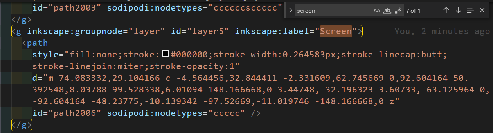
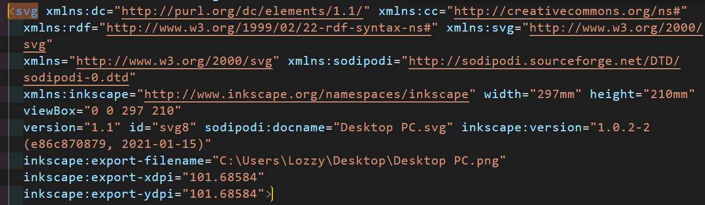
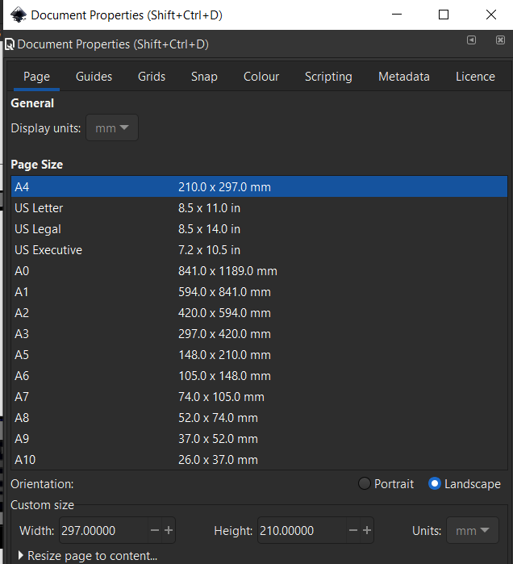

# Journey

<style>
  img {
    width: auto;
  }
  h1 {
    font-size: 34px;
  }
  h2 {
    font-size: 28px;
    text-decoration: underline;
  }
  h3 {
    padding-top: 20px;
    font-size: 22px;
    font-style: italic;
    font-weight: bold;
  }
  p, li, details, summary{
    font-size: 18px;
  }
  details {
    border: 2px 0px solid white;
    padding-bottom: 15px;
  }
  a {
    color: orange;
  }
  a:hover {
    color: yellow;
  }
</style>

### NOTE - The following tutorial cannot be done with a png. You MUST use an svg file. You will save yourself a lot of frustration and time!

## Initial Steps

- Created new vscode project ✔️
- Create assets folder in root directory ✔️
- create README.md in root directory ✔️
- Inside assets folder add the folders "cv_site", "images" and "images_documentation" ✔️
- In README add a title as well as a subtitle ##problems and solutions ✔️
- Create index.html, style.css and main.js ✔️
- In style.css add basic template to remove margin and padding, and change doc to border-box placement ✔️
- Bring in the SVG you would like to use into your images folder ✔️

## index.html and style.css

- In index.html add a container div.

```html
  <div class="container"></div>
```

- In style.css add the following

```css
  .container {
    display: flex;
    justify-content: center;
    width: 90%;
    margin: 0 auto;
  }
```

- inside the container add an image container div

```html
  <div class="container">
    <div class="image-container"></div>
  </div>
```

- In style.css add the following

```css
  .image-container {
    position: relative;
    width: fit-content;
    height: fit-content;
  }
```

- In index.html add the svg as an image tag

```html
  
```

- In style.css add the following to add some responsiveness to image on shrink

## Problems and Solutions

In using the SVG as an image I reached the same problem of being blocked from scrolling when the image was above the iframe.

One possible fix is to use the SVG on it's own as inline tag. It will create much ore dense HTML mark up, but may provide more flexibility.

I'm now attempting to use the SVG inline. Notice the two ids relating to the screen layer. id="layer5" and id="path2006"



### How to set the width of an SVG

Checkout this link on stackoverflow on [how to set the width of an svg to take up the parent containers width](https://stackoverflow.com/questions/8919076/how-to-make-a-svg-element-expand-or-contract-to-its-parent-container)

In your code check out the opening SVG tag



Notice that the viewbox has the values "0,0,297,210"?

If you go over to your Inkscape document and look for the document properties. You will see that the viewbox values match the width and height sizes you initially set when you made your inkscape project.



Don't worry that the width is wider than the height. This is what it's meant to be as it's set to landscape!
